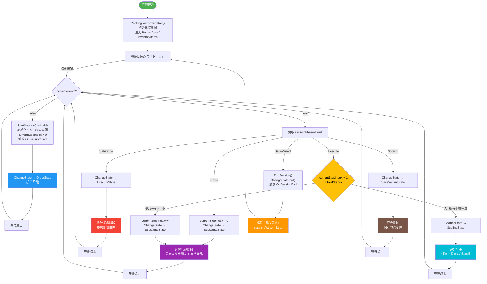
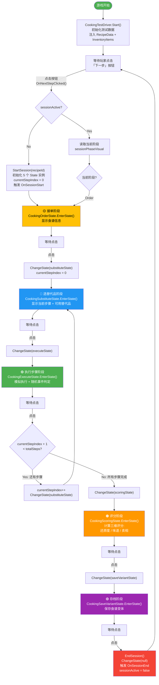

# 短循环交互测试场景搭建计划

## Context

项目已有基于 GameCriticalLoop.md 设计的骨架 Manager 体系（CookingSessionManager、RecipeManager、InventoryManager、RandomEventManager、EconomyManager、ScoringSystem），以及完整的状态机（CookingSessionStates.cs 中的 5 个 State）。但这些 Manager 全部是 TODO 空壳。需要搭建一个可交互的测试场景，用 Button 驱动短循环状态流转，验证整个 FSM 管线能跑通。

短循环状态流：**接单(Order) → 选替代品(Substitute) → 执行步骤(Execute) → 评分(Scoring) → 存档(SaveVariant)**

## 方案概述

创建一个新场景 `CookingTestScene`，包含：
1. 必要的基础设施 GameObject（InputManager、MouseManager、MouseInteractionLayer）
2. 所有短循环相关的 Manager 单例
3. 一个测试驱动脚本 `CookingTestDriver`，负责初始化假数据并响应按钮点击推进状态
4. UI 层：一个"下一步"按钮 + 状态信息文本显示

## 需要创建的文件

### 1. `Assets/Scripts/CookingSession/CookingTestDriver.cs` — 测试驱动脚本

职责：
- 持有对 `CookingSessionManager` 的引用
- 在 `Start()` 中用硬编码假数据初始化一个 RecipeData（3个步骤），调用 `StartSession`
- 提供 `public void OnNextStepClicked()` 方法，供按钮的 `selectEvent` 绑定
- `OnNextStepClicked` 根据当前 `CookingSessionManager.sessionPhaseVisual` 推进到下一个状态
- 持有一个 `TMP_Text` 引用，每次状态变化时更新显示当前阶段名称、步骤索引、假评分等信息

状态推进逻辑：
```
Order → 点击 → ChangeState(substituteState)
Substitute → 点击 → ChangeState(executeState)
Execute → 点击 → 如果还有下一步骤: currentStepIndex++ → ChangeState(substituteState)
                  如果所有步骤完成: ChangeState(scoringState)
Scoring → 点击 → ChangeState(saveVariantState)
SaveVariant → 点击 → 显示"流程完成"，可选重新开始
```

### 2. 修改现有文件

#### `Assets/Scripts/CookingSession/CookingSessionManager.cs`
- 实现 `StartSession(int recipeId)`：初始化 `currentRecipeId`、`currentStepIndex = 0`，实例化各 State 对象，`ChangeState(orderState)`，触发 `OnSessionStart` 事件
- 实现 `EndSession()`：`ChangeState(null)`，触发 `OnSessionEnd` 事件

#### `Assets/Scripts/CookingSession/CookingSessionStates.cs`
- 各 State 的 `EnterState` 中添加 `Debug.Log` 输出当前阶段信息（已有，保持不变）
- 不需要在 State 内部做实际逻辑，状态切换由 `CookingTestDriver` 外部驱动

### 3. 场景搭建（通过 MCP 工具）

场景层级结构：
```
CookingTestScene
├── Main Camera (Camera, 已有)
├── --- Infrastructure ---
│   ├── InputManager (InputManager + PlayerInput 组件)
│   └── MouseManager (MouseManager)
├── --- Managers ---
│   ├── CookingSessionManager (CookingSessionManager)
│   ├── RecipeManager (RecipeManager)
│   ├── InventoryManager (InventoryManager)
│   ├── RandomEventManager (RandomEventManager)
│   └── EconomyManager (EconomyManager)
├── --- Test UI ---
│   ├── MouseInteractionLayer (MouseInteractionLayer, 自动入栈)
│   ├── NextStepButton (SpriteRenderer + BoxCollider2D + Button_MouseInteract + ScaleCurveButton_Visual)
│   │   └── ButtonLabel (TextMeshPro: "下一步")
│   ├── StatusText (TextMeshPro: 显示当前状态)
│   └── CookingTestDriver (CookingTestDriver, 引用 CookingSessionManager + StatusText)
```

按钮使用项目已有的 `Button_MouseInteract` + `ScaleCurveButton_Visual` 组合，通过 `selectEvent` 绑定 `CookingTestDriver.OnNextStepClicked()`。

## 关键文件路径

| 文件 | 操作 | 说明 |
|------|------|------|
| `Assets/Scripts/CookingSession/CookingTestDriver.cs` | 新建 | 测试驱动脚本 |
| `Assets/Scripts/CookingSession/CookingSessionManager.cs` | 修改 | 实现 StartSession/EndSession |
| `Assets/Scripts/CookingSession/CookingSessionStates.cs` | 不改 | 保持现有骨架 |
| `Assets/Scenes/CookingTestScene.unity` | 新建 | 通过 MCP scene-create |

## 需要复用的现有代码

- `Button_MouseInteract`（[Assets/Scripts/MouseInteractive/Button/Button_MouseInteract.cs](Assets/Scripts/MouseInteractive/Button/Button_MouseInteract.cs)）— 按钮交互核心
- `ScaleCurveButton_Visual`（[Assets/Scripts/MouseInteractive/Button/Visuals/ScaleCurveButton_Visual.cs](Assets/Scripts/MouseInteractive/Button/Visuals/ScaleCurveButton_Visual.cs)）— 按钮缩放视觉反馈
- `MouseInteractionLayer`（[Assets/Scripts/MouseInteractive/MouseInteractionLayer.cs](Assets/Scripts/MouseInteractive/MouseInteractionLayer.cs)）— 鼠标交互层
- `MouseManager`（[Assets/Scripts/MouseInteractive/MouseManager.cs](Assets/Scripts/MouseInteractive/MouseManager.cs)）— 鼠标管理器
- `InputManager`（[Assets/Scripts/Controller/InputManager.cs](Assets/Scripts/Controller/InputManager.cs)）— 输入管理器
- `CookingSessionManager` 的 FSM 框架（ChangeState、Update 转发）
- `CookingPhaseStateBase` 及 5 个具体 State 类

## 执行步骤

1. 创建 `CookingTestDriver.cs`
2. 修改 `CookingSessionManager.cs`（实现 StartSession/EndSession + 初始化 State 实例）
3. 通过 MCP 创建新场景 `Assets/Scenes/CookingTestScene.unity`
4. 通过 MCP 在场景中创建 GameObject 层级
5. 通过 MCP 添加组件并配置引用
6. 保存场景

## 验证方式

1. 在 Unity Editor 中打开 `CookingTestScene`
2. 进入 Play Mode
3. 点击"下一步"按钮，观察：
   - Console 中 Debug.Log 输出各阶段的 EnterState/ExitState
   - StatusText 显示当前阶段名称和步骤信息
   - 按钮有 ScaleCurve 视觉反馈
4. 完整走完 Order → Substitute → Execute (×3步骤循环) → Scoring → SaveVariant → 完成
5. 确认 `OnSessionStart` 和 `OnSessionEnd` 事件正确触发

## 程序流程图



## 程序流程图


